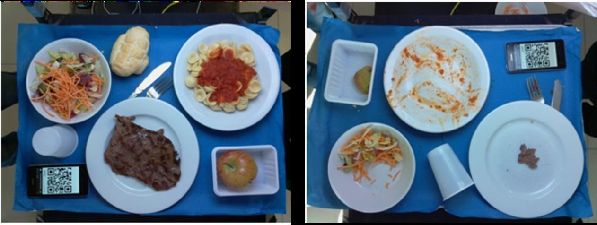
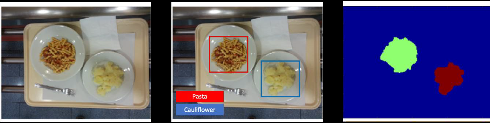

# Food Recognition & Leftover Estimation
This is a project carried out for Computer Vision Course in University of Padua.

## Table of contents
* [General Info](#General-Info)
* [Group Members](#Group-Members)
* [Task](Task)
* [Dataset Description](#Dataset-Description)
* [Project Structure](#Project-Structure)

## General Info
This study presents a computer vision system for object detection, segmentation, and evaluation. The system starts by reading input files, specifically a folder containing the trays to be analyzed. The code automatically scans the folder, reads the images, mask images, and bounding box files, providing feedback on the code's functionality. Various detection techniques such as template matching, template matching with scale and rotation invariance, SIFT feature-based matching and segmentation techniques such as Thresholding, Region Growing, Watershed, and Grabcut were explored, with Grabcut being selected as the most suitable algorithm for accurate segmentation. We only provide template matching and Grabcut algorithms with the code. The Grabcut algorithm effectively differentiated between foreground and background objects, even in the presence of color similarities. The system's segmentation performance was evaluated using ground truth annotations, aligning the segmentation approach with the reference annotations and fine-tuning the algorithm for optimal alignment. The evaluation included metrics such as mean average precision (mAP) for detection, mean intersection over union (mIoU) for segmentation, and food leftover estimation. The results demonstrated the effectiveness of the traditional computer vision techniques in detecting, segmenting, and evaluating objects.

## Group Members:
- Onur Alp Guvercin
- Suleyman Erim
- Stefano Deriu

### Task
The system to be developed should be able to 
- Recognize and localize all the food items in the tray images.
- Segment each food item in the tray image. 
- Compare the “before meal” and “after meal” images to find which food among the initial ones was eaten and which was not. 
- Estimate leftover quantity in number of pixels.
- Measure Performance with mean Average Precision(mAP) and mean Intersection over Union (mIoU)





## Dataset Description

### Dataset structure

The dataset is organized as the following. A folder is provided for each tray, containing:

- an image of the tray before the meal (`food_image.jpg`);
- an image of the tray with large food leftover, with dishes in the same position (`leftover1.jpg`);
- an image of the tray with large food leftover, with dishes in different position (`leftover2.jpg`);
- an image of the tray with minimal food leftover, with dishes in the different position (`leftover3.jpg`);
- a `bounding_boxes` folder containing the bounding box annotations of each image;
- a `masks` folder containing the segmentatio mask annotations of each image.
 
### Food categories

The benchmark dataset includes a total of 14 food categories. Each category is assigned to a unique food ID:

0. Background
1. pasta with pesto
2. pasta with tomato sauce
3. pasta with meat sauce
4. pasta with clams and mussels
5. pilaw rice with peppers and peas
6. grilled pork cutlet
7. fish cutlet
8. rabbit
9. seafood salad
10. beans
11. basil potatoes
12. salad
13. bread

### Tray Composition 

tray1: pesto pasta, grilled pork cutlet, beans
tray2: pasta with tomato sauce, fish cutlet, basil potatoes, salad
tray3: tomato pasta, rabbit, salad
tray4: pilaw rice with peppers and peas, fish cutlet, basil potatoes, salad, bread
tray5: pasta with meat sauce, rabbit, beans, bread
tray6: clam and mussel stir-fry, grilled pork chop, beans, salad
tray7: pasta with clams and mussels, fish cutlet, basil potatoes, salad
tray8: pasta with clams and mussels, seafood salad, basil potatoes, beans, salad

## Project Structure
```bash
├── trays(dataset)
├── templates(for Template Matching)
├── Report.pdf
├── CMakeLists.txt (Cmake compile file)
├── annotation.cpp
├── annotation.h
├── segmentation.cpp
├── segmentation.h
├── evalutation.cpp
├── evaluation.h
└── README.md
```
